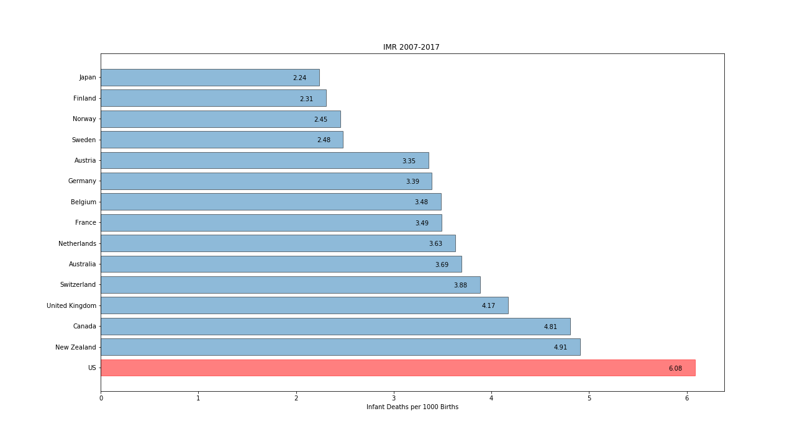
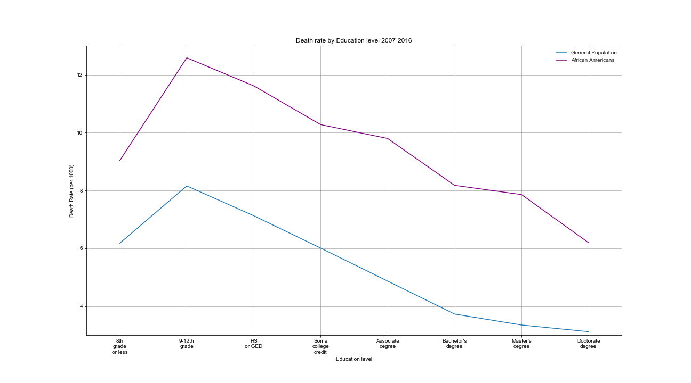
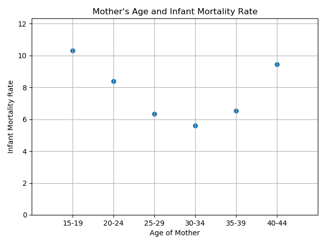
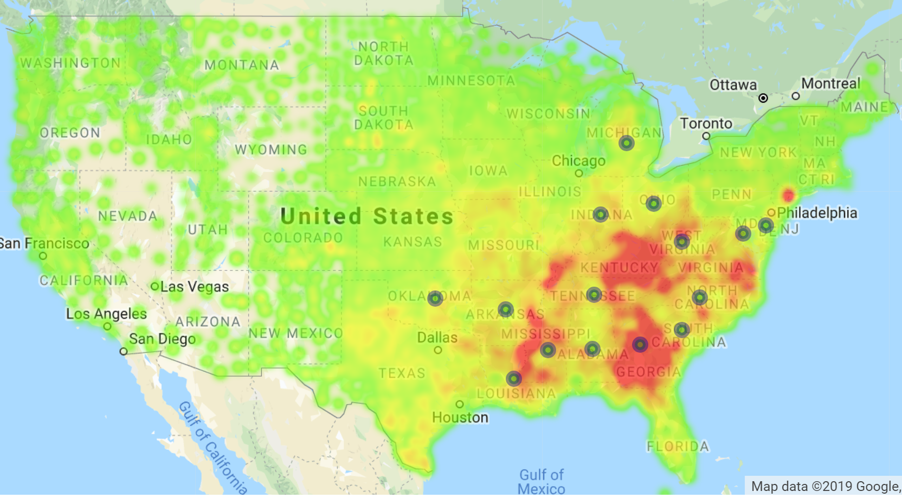
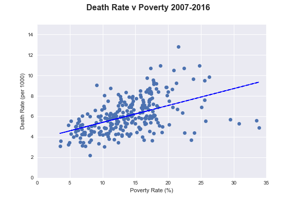
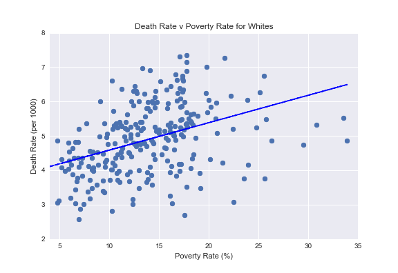
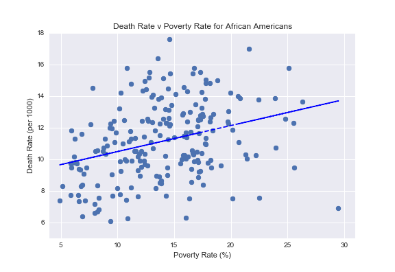
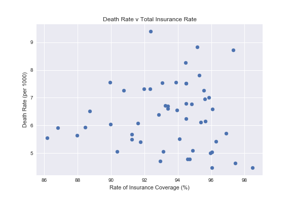
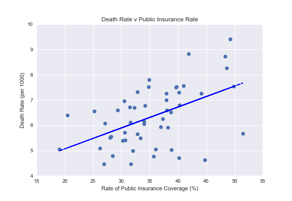
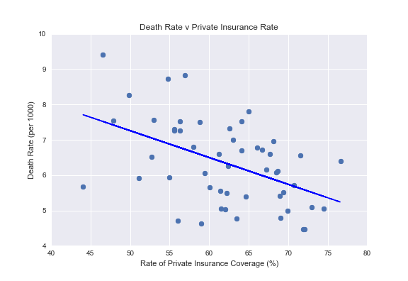

# Infant Mortality Rates

## Team Members:

Logan Caldwell, John Chambers, Jasmina Jovanovic, Hyunsoo Kim, and Ediya Yumukoff

## Project Description:

The United States has a higher Infant Mortaility Rate than any other wealthy country in the world. We set out to investigate the causes of Infant Deaths in the United States and the associated factors. 

## Research Questions to Answer:

* What are the leading causes of infant deaths in the US?
* Is there a correlation between poverty and IMR?
* Do different races experience different levels of IMR?
* How does the education level of the mother relate to IMR?
* Does the age of the mother play a role in IMR?
* Does having health insurance lower the rate of IMR?
* Does infants' birthweight affect the IMR?

## Datasets Used:

* CDC
https://wonder.cdc.gov/

* US Census
https://www2.census.gov/programs-surveys/demo/tables/health-insurance/time-series/acs/hic05_acs.xls

* USDA
https://www.ers.usda.gov/data-products/county-level-data-sets/download-data/

* World Health Organization
https://www.who.int/gho/database/en/

* Kaiser Family Foundation
https://www.kff.org/statedata/

## Data Wrangling Methodology

* Most of the datasets obtained from the CDC had some results that were unreliable. We removed those rows that were marked unreliable (statistically not significant, with fewer than 20 deaths in that category)
* In other cases, we kept rows that had NaN values in them, for instance if the education level of the mother was not reported. We made a call on case by case basis based on what portion of the overall results that category represents
* In addition to data from the CDC we relied on the US Census, USDA, Kaiser Family Foundation datasets. Any merging of the dataframes was performed on a well defined key, such as county ID

## Questions - Answered

### What are the leading casuses of infant deaths in the US?

- The leading cause of infant death is extreme immaturity, followed by Sudden Infant Death Syndrome (SIDS). Extremely premature babies are babies born before 28 weeks of gestational age. (Note that there is a correlation between the two leading causes of infant death, since SIDS rates are higher amont premature babies.)
- Most infant deaths occur either in the first 24 hours after birth as a result of extreme immaturity, or between one month and one year, as a result of SIDS 

### Do different races experience different levels of IMR?

- There is a strong correlation between race and IMR
- African Americans have the highest IMR of all races, followed by American Indian/Alasks Native and then by Asians and Whites
- The IMR among African American babies is more than twice as high as that of White infants
- We performed a ANOVA test and a pairwise tukeyhsd test, which confirmed that the differences in rate of IMR across races is statistically significant 

- African American babies have double the rate of every leading cause of death compared to White babies
- It is possible that there are inaccuracies in the cause of death for the American Indian / Alaska Native race

### Does infants' birthweight affect the IMR?

- Babies weighing less than 1 kg (2.2 lb) at birth have the highest mortality rate.

- Rate of overweight mothers was high in Hispanics, White, and American Indian, but Infant Mortality was relatively low.

### How does the education level of the mother relate to IMR?

* In every state, differences in infant mortality are seen between babies born to the most-educated mothers, who are least likely to die in the first year of life, and babies born to mothers with less education.

* African American Infants whose mothers received less than 12 years of education are, in some states, almost twice as likely to die as those born to college (or higher) educated mothers.

* African American Infants' death rate is still much higher than average, even when comparing same levels of education

### Does the age of the mother play a role in IMR?

* The IMR is highest with very young mothers and mothers over 40
* We don't know for sure why IMR is so high with very young mothers, but suspect that it may be related to level of education or poverty

### Is there a correlation between poverty and IMR?

* Poverty and IMR have a postive correlation.

Average poverty by county for 2007-2016. Markers represent 15 highest IMR states:

* There is a clear correlation between IMR and poverty levels. 

* Even though the correlation holds for both Whites and African Americans, African Americans experience higher levels of IMR than Whites for similar poverty levels. 

### Does having health insurance lower the rate of IMR?

* There is no correlation between IMR and total rates of insurance.

* There is a positive correlation between IMR and having public insurance or private insurance

## Conclusions

* We identified multiple factors that affect IMR: mother's age, mother's education level, race, infant's birth weight, poverty, and rate of public insurance coverage
* More hypothesis that we tested can be see in our code (e.g. mother's obesity and hyptertension, month in which prenatal care began)
* The factors with the strongest correlations with IMR are race and poverty
* Even when controlling for race, no single factor could explain the differences in IMR between African American and White/Asian babies (the biggest gap in IMR)
* There is not a strong correlation between mother being overweight and IMR

## Limitations

* In some cases where we worked we multiple data sources, one data source includes an extra year compared to the other
* CDC datasource contained a lot of NaN fields, which may skew the results
* In some datasets Hispanics are categorized as a race, while in others they are not. Most of our analysis of IMR did not include Hispanics as a separate race

## Suggestions for Further Study

* Examine racial differences in terms of rates of public versus private health insurance
* Examine racial diferences in terms of access to quality hospitals and the probability of an extremely premature infant to survive
* Examine correlation between vitamin D defficiency and premature labor between different races

